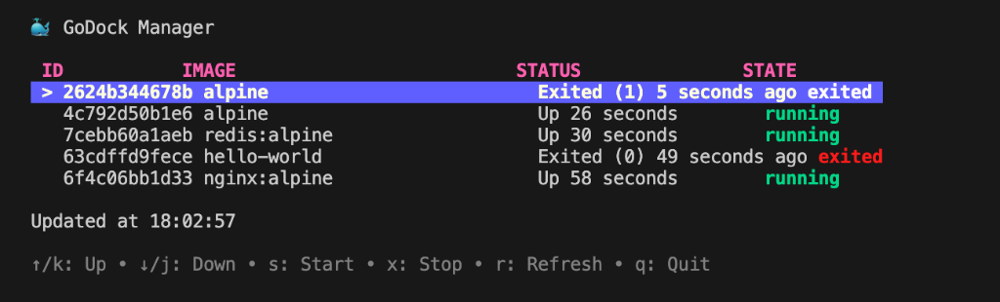

# 🐳 GoDock TUI Manager



> A modern, keyboard-centric Terminal User Interface (TUI) for managing local Docker containers, built with **Go** and **Bubble Tea**.

## 🚀 Overview

**GoDock TUI Manager** is a lightweight dashboard designed for developers who prefer the efficiency of the command line. It provides a real-time view of your Docker containers, allowing you to monitor status, and perform quick actions like starting, stopping, or refreshing the list without leaving your terminal.

## ✨ Features

- **Real-time Monitoring**: View running and stopped containers instantly.
- **Keyboard Navigation**: Vim-style (`j`/`k`) and arrow key navigation.
- **Quick Actions**:
  - **Start** stopped containers (`s`).
  - **Stop** running containers (`x`).
  - **Refresh** the container list (`r`).
- **Asynchronous Operations**: Background processing ensures the UI remains responsive during Docker API calls.
- **Modern UI**: Styled with [Lipgloss](https://github.com/charmbracelet/lipgloss) for a polished look and feel.

## 🛠️ Tech Stack

- **Language**: [Go (Golang)](https://go.dev/)
- **TUI Framework**: [Bubble Tea](https://github.com/charmbracelet/bubbletea) (The Elm Architecture in Go)
- **Styling**: [Lipgloss](https://github.com/charmbracelet/lipgloss)
- **Docker SDK**: [Docker Engine API](https://docs.docker.com/engine/api/sdk/)

## 🏗️ Architecture

The application follows a modular Clean Architecture approach:

```
├── main.go         # Application entry point
├── docker/         # Wrapper around Docker SDK (Infrastructure Layer)
├── ui/             # Bubble Tea Model, View, and Update logic (Presentation Layer)
├── styles/         # Centralized Lipgloss design system
└── assets/         # Project assets and screenshots
```

## 📦 Installation & Usage

### Prerequisites
- Go 1.20+
- Docker Engine running locally

### Run Locally

1. **Clone the repository**
   ```bash
   git clone https://github.com/ahmedmaaloul/godock-tui-manager.git
   cd godock-tui-manager
   ```

2. **Run the application**
   ```bash
   go run .
   ```

## 🎮 Key Bindings

| Key | Action |
| :--- | :--- |
| `↑` / `k` | Move cursor up |
| `↓` / `j` | Move cursor down |
| `s` | **Start** selected container |
| `x` | **Stop** selected container |
| `r` | **Refresh** container list |
| `q` / `Ctrl+C` | Quit application |

---

*Built with ❤️ in Go.*
